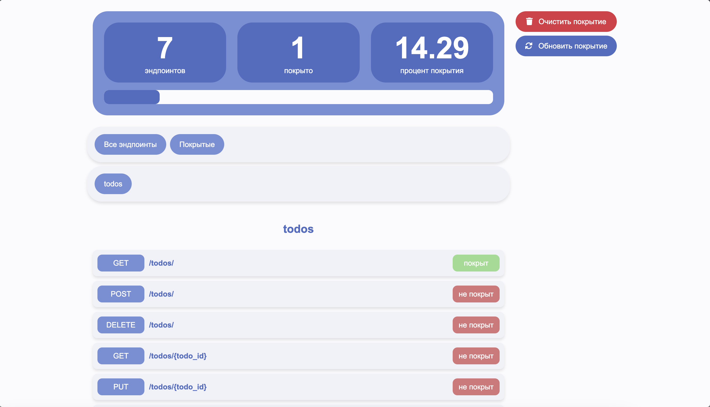

<p align="center">
  
</p>

<p align="center">
  
</p>

# Понимайте на какие эндпоинты при тестировании вы уже обратили внимание, а на какие нет.

---

## Запуск

1. Ставим poetry: <https://python-poetry.org/docs/>
2. ```task install-deps``` или ```poetry install```
3. ```task run``` или ```cd src && poetry run uvicorn main:app --port 8000```
4. Открываем <http://127.0.0.1:8000> для интеграции через веб интерфейс и <http://127.0.0.1:8000/docs> для интеграции через апи.

---

## Пример использования

```python
import requests

BASE = "http://127.0.0.1:8000"

# 1. Указываем Swagger-спецификацию и базовый URL тестируемого API
requests.post(f"{BASE}/set_urls", json={
    "base_url": "https://api.example.com",
    "swagger_url": "https://api.example.com/swagger.json",
})

# 2. Тестируем эндпоинты через прокси — каждый пройденный запрос
#    автоматически отмечается как покрытый
requests.get(f"{BASE}/proxy/users")
requests.post(f"{BASE}/proxy/users", json={"name": "Alice"})
requests.get(f"{BASE}/proxy/users/1")

# 3. GET / — открыть веб-отчёт с процентом покрытия
report = requests.get(f"{BASE}/")

# 4. Сбросить покрытие
requests.post(f"{BASE}/clear_coverage")

# 5. Обновить спецификацию
requests.post(f"{BASE}/refresh_spec")
```

---

<p align="center">
  <a href="http://127.0.0.1:8000/docs">Документация API</a>
  ·
  <a href="https://github.com/victoretc/api-coverage-by-swagger/actions">GitHub Actions</a>
</p> 